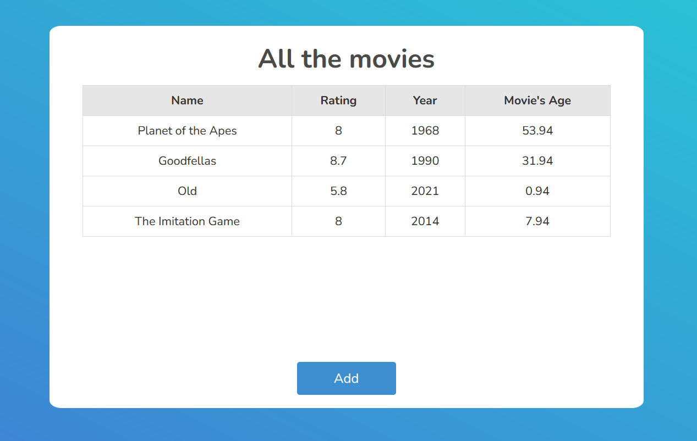
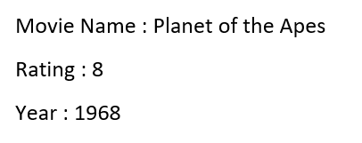
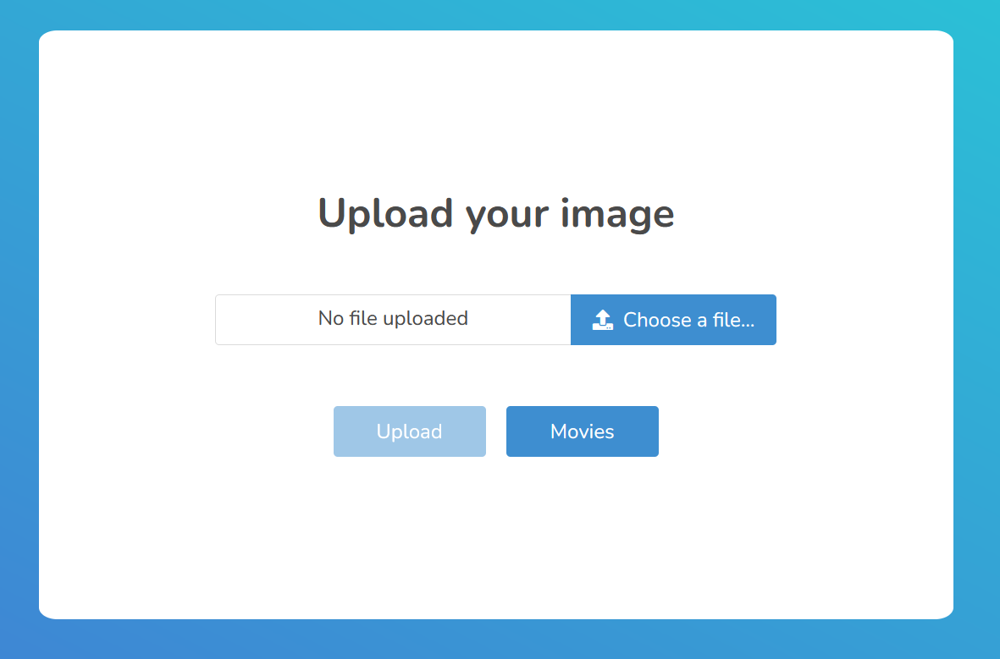

<div id="top"></div>

<!-- TABLE OF CONTENTS -->
<details>
  <summary>Table of Contents</summary>
  <ol>
    <li>
      <a href="#about-the-project">About The Project</a>
      <ul>
        <li><a href="#built-with">Built With</a></li>
      </ul>
    </li>
    <li>
      <a href="#getting-started">Getting Started</a>
      <ul>
        <li><a href="#prerequisites">Prerequisites</a></li>
        <li><a href="#installation">Installation</a></li>
      </ul>
    </li>
    <li><a href="#usage">Usage</a></li>
  </ol>
</details>


<!-- ABOUT THE PROJECT -->
## About The Project



This project aims to extract the information about a movie from an image, store it in a Mongodb database and then display a table containing the various extracted
movies. <br>
<br>
An image should look like this:

<kbd></kbd>

<br>


<p align="right">(<a href="#top">back to top</a>)</p>


### Built With

This web project is developed mainly with the MEAN stack and some other frameworks and libraries.

* [Angular](https://angular.io/)
* [Node.js](https://nodejs.org)
* [MongoDB](https://www.mongodb.com/)
* [Express.js](https://expressjs.com/)
* [Bulma](https://bulma.io/)
* [Tesseract.js](https://tesseract.projectnaptha.com/)
* [Luxon](https://moment.github.io/luxon)
* [Multer](https://www.npmjs.com/package/multer)


<p align="right">(<a href="#top">back to top</a>)</p>


<!-- GETTING STARTED -->
## Getting Started

These are instructions to get a local copy up and running. <br>


### Prerequisites

1. Install mongoDB Community edition to have it locally running.

2. Install the Node Package Manager.
  ```sh
  npm install npm@latest -g
  ```


### Installation

1. Clone the repo
   ```sh
   git clone https://github.com/hazem-farhani/movie-saver.git
   ```
2. Install NPM packages for both environment
   ```sh
   cd frontend
   npm install
   ```
   ```sh
   cd backend
   npm install
   ```


<p align="right">(<a href="#top">back to top</a>)</p>


<!-- USAGE EXAMPLES -->
## Usage

In order to add some movies to the database, you need to go to the upload page and add an image in the format shown above.



The movie extracted from the image will be automatically added to the main table in the home page. As to the field "Movies's Age", it will be automatically calculated
with the library 'Luxon'.

<p align="right">(<a href="#top">back to top</a>)</p>


